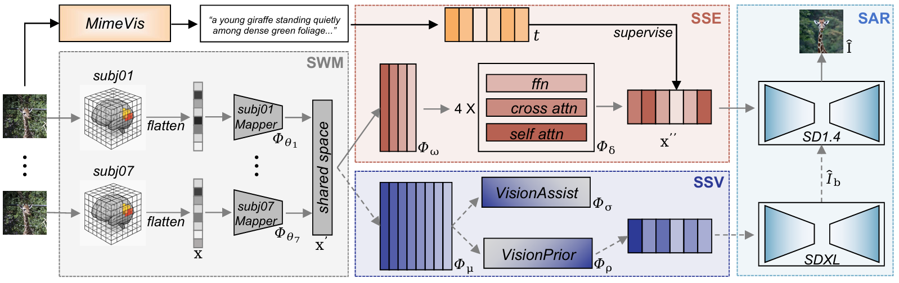

<div align="center">
  <div style="display: flex; align-items: center; justify-content: center; margin-bottom: 15px;">
     <h1 style="border-bottom: none; margin: 0;">SynMind:Reducing Semantic Hallucination in fMRI-Based Image Reconstruction</h1>
  </div>

</div>

<p align="center">
  <a href="https://www.python.org/downloads/release/python-3100/">
    
  </a>
<a href="https://huggingface.co/datasets/YanmHa/SynMind">
  
</a>
<a href="https://huggingface.co/datasets/YanmHa/SynMind">
  
</a>
  <a href="https://opensource.org/licenses/MIT">
    
  </a>
</p>
<div align="center">
  <div style="display: flex; align-items: center; justify-content: center; margin-bottom: 15px;">
    
  </div>
  
</div>

SynMind is a codebase for semantic fMRI-to-image reconstruction on the Natural Scenes Dataset (NSD). The repository contains training, latent prediction, blurry reconstruction, unCLIP-based image generation, and text-guided enhancement code for turning brain activity into image and text representations.
## 📑 Overview

The current pipeline is organized into several stages:

1. Train a brain encoder and diffusion priors from NSD fMRI features.
2. Predict image-space and text-space latents from held-out brain signals.
3. Decode blurry image latents with a VAE.
4. Reconstruct sharper images with unCLIP / diffusion models.
5. Optionally refine reconstructions with text-conditioned image-to-image generation.

In practice, the code combines:

- subject-specific ridge regression for fMRI alignment
- a brain backbone that predicts CLIP-style image and text representations
- diffusion priors for image and text latent generation
- VAE-based blurry reconstruction
- diffusion-based image enhancement

## Paper-to-Code Module Mapping

The implementation keeps several historical engineering names for checkpoint and script compatibility. The table below maps the paper terminology to the current code paths, classes, and call sites.

| Paper module | Description | Implementation |
|---|---|---|
| `MimeVis` | Generates human-like, multi-granularity semantic descriptions for visual stimuli. The generated descriptions provide semantic supervision for the text/semantic branch. | `trains/MimeVis.py` |
| `SWM` Subject-Wise Mapper | Projects subject-specific fMRI signals with different voxel dimensions into a unified shared latent space. | `trains/main_sem.py` and `trains/inference.py`(`model.ridge`) |
| `SSE` Subject-Shared Semantic Encoder | Maps shared fMRI latents into the semantic/text embedding space, aligning brain signals with MimeVis-derived semantic supervision. | `trains/models.py`(`BrainNetwork`) |
| `SSV` Subject-Shared Visual Encoder | Maps shared fMRI latents into visual CLIP / unCLIP feature space for visual reconstruction. | `trains/models.py`(`BrainNetwork`) |
| `SAR` Semantic-Aware Render | Uses predicted visual and semantic features to produce the final image reconstructions. | `recons/models.py`(`BrainDiffusionPrior + PriorNetwork`), `recons/recon_I2I.py`, `recons/recon_TextEhanced.py`, and `recons/enhanced_recon.py` |

## 📂 Expected Data and Assets

Before running the project on a new machine, update paths inside the scripts or refactor them into configuration arguments.

## 🚀 Environment

A practical starting environment looks like this:

```bash
conda create -n synmind python=3.10 -y
conda activate synmind

pip install torch torchvision torchaudio 
pip install diffusers accelerate h5py psutil dalle2-pytorch
```

Additional packages used across the repository include:

- `einops`
- `transformers`
- `omegaconf`
- `pytorch-lightning`
- `matplotlib`
- `pillow`
- `webdataset`


## Training

The main training script is:

```bash
python trains/mian_sem.py --model_name exp01 --batch_size 48 --epochs 60 --use_prior
```


## Inference

After training, latent predictions can be exported with:

```bash
python trains/inference.py --model_name exp01 --batch_size 256 --use_prior
```

## Reconstruction Stages

### 1. Blurry Reconstruction

Decode predicted VAE latents back into low-frequency reconstructions:

```bash
cd recons
python recon_blurry.py
```

### 2. unCLIP Reconstruction

Generate image reconstructions from predicted image latents:

```bash
cd recons
python recon_I2I.py
```

### 3. Text-Guided Enhancement

Refine reconstructions with predicted text latents and Stable Diffusion img2img:

```bash
cd recons
python recon_TextEhanced.py
```

### 4. Caption-Assisted Enhancement

Use caption predictions to further improve image quality:

```bash
cd recons
python enhanced_recon.py
```

## Citation


If you use this code in a paper or project, please consider citing our work:

**SynMind: Reducing Semantic Hallucination in fMRI-Based Image Reconstruction**  
Lan Yang, Minghan Yang, Ke Li, Honggang Zhang, Kaiyue Pang, Yi-Zhe Song  
*IEEE Transactions on Multimedia*, 2026.

```bibtex
@article{yang2026synmind,
  title   = {SynMind: Reducing Semantic Hallucination in fMRI-Based Image Reconstruction},
  author  = {Yang, Lan and Yang, Minghan and Li, Ke and Zhang, Honggang and Pang, Kaiyue and Song, Yi-Zhe},
  journal = {IEEE Transactions on Multimedia},
  year    = {2026},
  publisher = {IEEE}
}
```

